# Who-s-that-pokemon

## Reto 1 - Iniciando Proyecto Pokemon Game

### Creacion del proyecto en VueJS:

Utilizamos el siguiente comando para la creacion del proyecto

```bash
npm create vue@latest
```

A continuación, VueJS nos preguntara que configuracion queremos en nuestro proyecto siendo esta la siguiente:

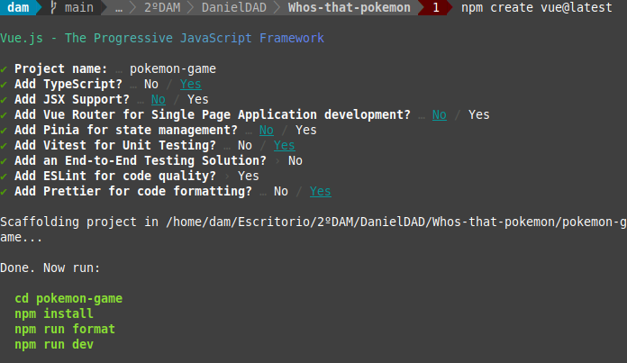

Respondemos a las siguientes preguntas

-¿Para qué sirve Vue Router, Pinia, Vitest, ESLint y Prettier?

        Vue Router: Es una herramienta para manejar el enrutamiento en las aplicaciones Vue.

        Pinia: Es una biblioteca de tiendas para Vue, le permite compartir un estado entre componentes/páginas.

        Vitest: Se puede escribir y ejecutar pruebas de manera eficiente en proyectos Vue.

        ESLint: Es un proyecto de código abierto que lo ayuda a encontrar y solucionar problemas con su código JavaScript.

        Prettier: Es una herramienta para formatear el codigo dandole un estilo consistente.


Para continuar, ejecutamos los compandos y comprobamos que nuesta aplicacion VueJS funciona correctamente.

accedemos a la carpeta del proyecto

```bash
cd pokemon-game
```
hacemos las instalaciones necesarias

```bash
npm install
```
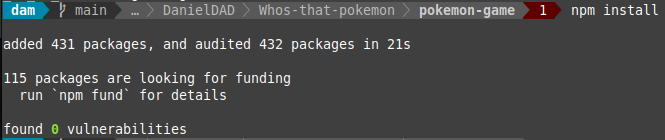

```bash
npm run format
```

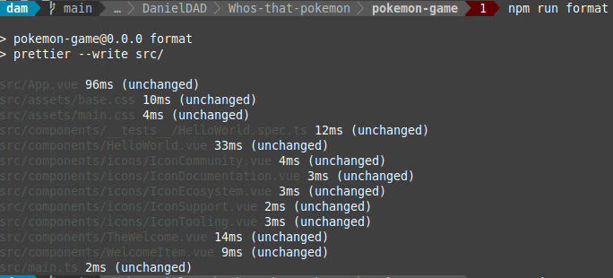


y por ultimo inicializamos el proyecto

```bash
npm run dev
```


y accedemos a la direccion local que en este caso es: __http://localhost:5173/

y vemos que se funciona correctamente

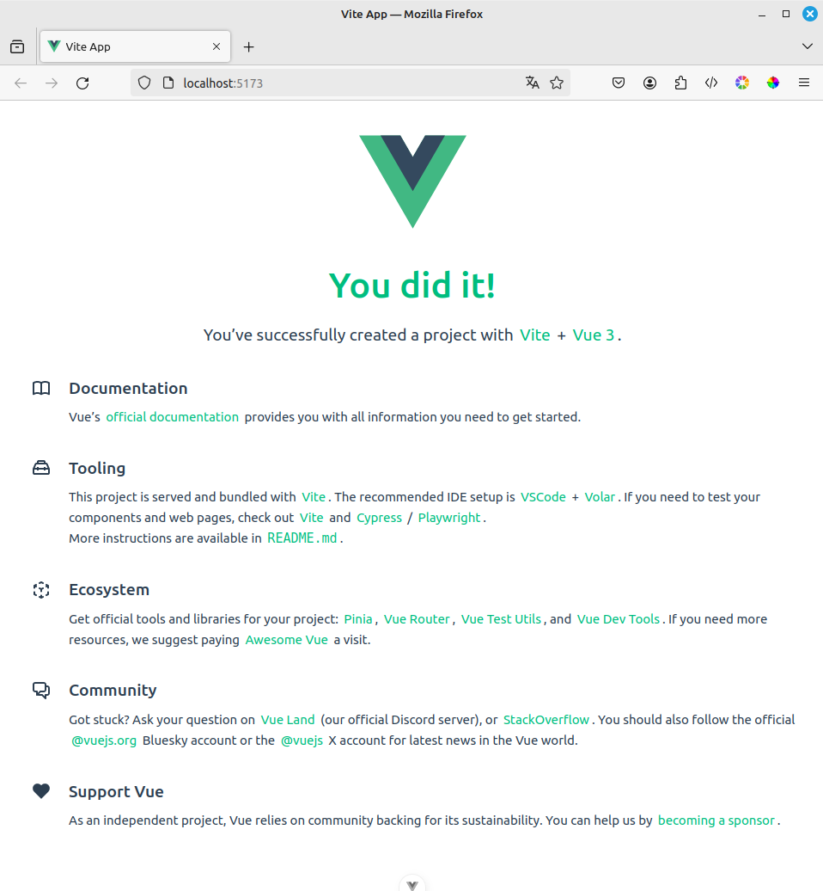


Nuestro Pokemon Game lo vamos a realizar siguiendo Composition API y además, nuestra estructura de archivos va a estar basada en screaming architecture.

¿Qué es Composition API y en qué se diferencia de Option API en VueJS?

    Composition API es un conjunto que nos permite crear componentes de Vue utilizando funciones importadas en lugar de como en Option Api utiliza Objetos.

¿Qué es screaming architecture y qué ventajas tiene?

    Se enfoca en organizar el código alrededor de los objetos de negocio, en lugar de una estructura convencional de carpetas lo que facilita la comprensión, el mantenimiento y la escabilidad del código.


Ahora, vamos a modificar y borrar todo lo que no necesitamos que nos ha creado de forma automática VueJS: 

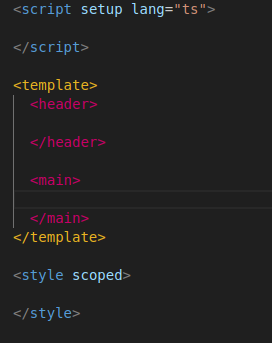


El contenido de App.vue y deja la estructura básica de VueJS teniendo en cuenta que usaremos Composition API. Recuerda que vamos a utilizar TS en lugar de JS, ¿cómo se lo indicamos a Vue?
    
    Como se ve en la imagen anterior en el scrip le indicamos que utilizamos ts


Añade un mensaje de Hola mundo en App.vue

Se veria el codigo de la siguiente manera:

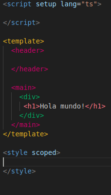

Siendo como resultado la siguiente vista:

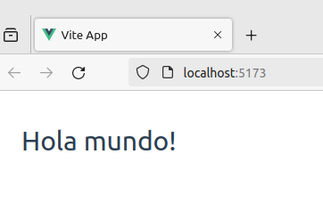


En la carpeta de assets, borra los archivos base.css y logo.svg
Cambia el nombre de main.css de la carpeta assets a styles.css y modifica la ruta en el archivo main.ts para que funcione correctamente nuestra hoja de estilo.

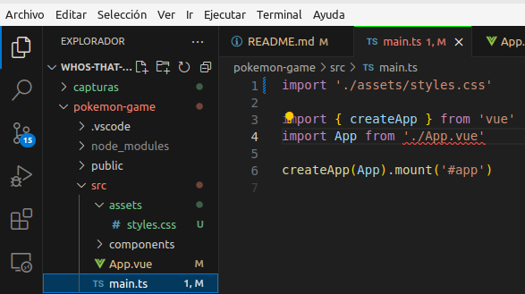

    Ejecuta el comando npm run dev y muestra el resultado.

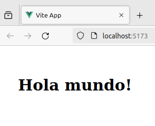


Para realizar nuestra aplicación en lugar del framework de CSS Bootstrap, vamos a usar Tailwind CSS, ¿lo conoces?

    Tailwind CSS es un framework de CSS de código abierto para el diseño de páguinas web.

Configuramos el proyecto para poder installar Tailwind
    primero usamos el siguiente comando para la instalacion de dependendias y la generacion de los archivos tailwind.config.js and postcss.config.js

```bash
npm install -D tailwindcss postcss autoprefixer
npx tailwindcss init -p
```

Añadimos los Paths de los ficheros en tailwind.config.js

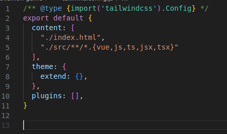

Añadimos tailwind al CSS

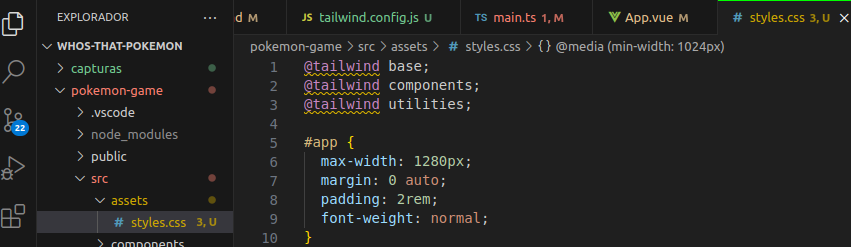

Probamos añadiendole una clase al h1 del hola mundo que pusimos anteriormente

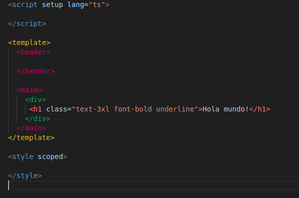

Verificamos el funcionamiento utilizando npm run dev

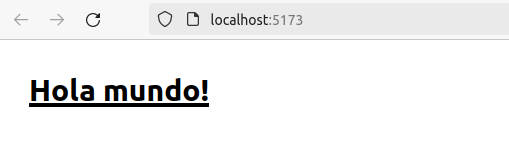


## Reto 2 - Estructura de la aplicación


Como no cumplimos con la filosofia de screamin architecture vamos a comenzar modificando la estructura del proyecto.

primero eliminamos la carpeta components y creamos una nueva carpeta dentro de src llamada modules y dentro de esta una llamada pokemon 

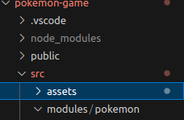

Dentro de la carpeta pokemon creamos las carpetas composables __¿Qué es un composable en VueJS y cual es la nomenclatura común que se utiliza en los ficheros que contiene?__

    asdasdad


Creamos las carpetas components y views.


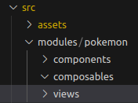


Dentro de la carpeta de view creamos un archivo PokemonGame.vue

__¿cuál crees que será la lógica que irá dentro de este archivo?__

Estaremos utilizadno Coposition API


