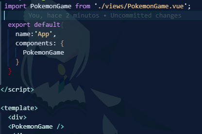

<div align="justify">

# Who-s-that-pokemon

Repositorio dedicado a la actividad de VUE del módulo DAD acerca de la adivinacion de un pokemon a través de su silueta

<div align="center">

</div>

## Índice

- [Reto 1](#reto1)
    - [Creacion del proyecto en VueJS:](#creacion-del-proyecto-en-vuejs)
    - [limpieza del proyecto](#Limpieza-de-la-estructura-de-la-aplicacion)
    - [Tailwind en el proyecto](#Tailwind)
- [Reto 2](#reto2)
    - [Creacion de la estructura de carpetas](#creacion-de-la-estructura-de-carpetas)
- [Reto 3](#reto3)
    - [PokemonPicture.vue](#pokemonpicturevue)
    - [PokemonOptions.vue](#pokemonoptionsvue)
- [Reto 4](#reto4)
    - [Conexion a la api](#conexion-a-la-api)
    - [Tipando la petición a la api](#tipando-la-petición-a-la-api)
        - [instalacion de axios](#instalacion-de-axios)
- [Reto 5](#reto5)
    - [Modificando método getPokemons()](#modificando-método-getPokemons)


# Retos


## Reto1 - Iniciando Proyecto Pokemon Game

### Creacion del proyecto en VueJS:

Utilizamos el siguiente comando para la creacion del proyecto

```bash
npm create vue@latest
```

A continuación, VueJS nos preguntara que configuracion queremos en nuestro proyecto siendo esta la siguiente:


Respondemos a las siguientes preguntas

> ¿Para qué sirve Vue Router, Pinia, Vitest, ESLint y Prettier?
>
> Vue Router: Es una herramienta para manejar el enrutamiento en las aplicaciones Vue.
>
>    Pinia: Es una biblioteca de tiendas para Vue, le permite compartir un estado entre componentes/páginas.
>
>   Vitest: Se puede escribir y ejecutar pruebas de manera eficiente en proyectos Vue.
>
>   ESLint: Es un proyecto de código abierto que lo ayuda a encontrar y solucionar problemas con su código JavaScript.
>
>    Prettier: Es una herramienta para formatear el codigo dandole un estilo consistente.


Para continuar, ejecutamos los compandos y comprobamos que nuesta aplicacion VueJS funciona correctamente.

accedemos a la carpeta del proyecto

```bash
cd pokemon-game
```
hacemos las instalaciones necesarias

```bash
npm install
```


```bash
npm run format
```


y por ultimo inicializamos el proyecto

```bash
npm run dev
```


y accedemos a la direccion local que en este caso es: __http://localhost:5173/

y vemos que  funciona correctamente


Nuestro Pokemon Game lo vamos a realizar siguiendo Composition API y además, nuestra estructura de archivos va a estar basada en screaming architecture.

> ¿Qué es Composition API y en qué se diferencia de Option API en VueJS?
>Composition API es un conjunto que nos permite crear componentes de Vue utilizando funciones importadas en lugar de como en Option Api utiliza Objetos.

>  ¿Qué es screaming architecture y qué ventajas tiene?
>Se enfoca en organizar el código alrededor de los objetos de negocio, en lugar de una estructura convencional de carpetas lo que facilita la comprensión, el mantenimiento y la escabilidad del código.


Ahora, vamos a modificar y borrar todo lo que no necesitamos que nos ha creado de forma automática VueJS: 


El contenido de App.vue y deja la estructura básica de VueJS teniendo en cuenta que usaremos Composition API. Recuerda que vamos a utilizar TS en lugar de JS, 
> ¿Cómo se lo indicamos a Vue?
>
> Como se ve en la imagen anterior en el scrip le indicamos que utilizamos ts


Añade un mensaje de Hola mundo en App.vue

Se veria el codigo de la siguiente manera:


Siendo como resultado la siguiente vista:


## Limpieza de la estructura de la aplicacion

En la carpeta de assets, borra los archivos base.css y logo.svg
Cambia el nombre de main.css de la carpeta assets a styles.css y modifica la ruta en el archivo main.ts para que funcione correctamente nuestra hoja de estilo.


Ejecuta el comando npm run dev y muestra el resultado.


## Tailwind

Para realizar nuestra aplicación en lugar del framework de CSS Bootstrap, vamos a usar Tailwind CSS,
> ¿lo conoces?
>
>    Tailwind CSS es un framework de CSS de código abierto para el diseño de páguinas web.

Configuramos el proyecto para poder installar Tailwind
    primero usamos el siguiente comando para la instalacion de dependendias y la generacion de los archivos tailwind.config.js and postcss.config.js

```bash
npm install -D tailwindcss postcss autoprefixer
npx tailwindcss init -p
```

Añadimos los Paths de los ficheros en tailwind.config.js


Añadimos tailwind al CSS


Probamos añadiendole una clase al h1 del hola mundo que pusimos anteriormente


Verificamos el funcionamiento utilizando npm run dev


Y aqui finaliza el primer reto


## Reto2 - Estructura de la aplicación


### Creacion de la estructura de carpetas 

Como no cumplimos con la filosofia de screamin architecture vamos a comenzar modificando la estructura del proyecto.

primero eliminamos la carpeta components y creamos una nueva carpeta dentro de src llamada modules y dentro de esta una llamada pokemon 


Dentro de la carpeta pokemon creamos las carpetas composables

> ¿Qué es un composable en VueJS y cual es la nomenclatura común que se utiliza en los ficheros que contiene?
>
>    Un composable en Vue.js es una función que encapsula lógica reutilizable para que puedas usarla en varios componentes. Sirve para organizar mejor el código y evitar repetir la misma lógica en diferentes partes de tu aplicación.


Creamos las carpetas components y views.


Dentro de la carpeta de view creamos un archivo PokemonGame.vue

> ¿Cuál crees que será la lógica que irá dentro de este archivo?
>
>Estaremos utilizando Composition API

> ¿Conoces algún atajo para generar esta estructura de forma automática? ¿Con qué extensión y cuál?
>
>Con la extension de VSCode de vue-Official, puedes utilizar el snippet vcc para definir que es un componente de composition con el siguiente contenido __vbase-3-ts-setu__


### Separacion de la estructuras en secciones

Utilizando la etiqueta __<section>__ podemos separar nuestra aplicación en secciones donde tendremos:

  - Una sección que tenga un mensaje que indique al usuario que: ``Espere por favoy y Cargando Pokémon`` de tal manera que:

  

  las clases utilizadas son de Tailwind para darle un estilo a nuestra sección siendo:

   - __flex__ : Aplica el layout de flexbox al contenedor haciendo que los hijos se alineen en horizontal o vertical.

   - __flex-col__ : Cambia la dirección del eje principal a vertijal haciendo que los hijos se alineen de arriba a abajo
   
   - __justify-center__ : Centra los hijos en el eje pincipal siendo este caso en vertical por la clase anterior
   
   - __items-center__ : Centra los hijos en el eje secundario
   
   - __w-screen__ : Define que el ancho del contenedor sea igual al ancho de la pantalla
   
   - __h-screen__ : Define que el alto del contenedor sea igual al alto de la pantalla
   
   - __text-3xl__ : Define el tamaño del texto como 3xl siendo este una fuente de 30px
   
   - __animate-pulse__ : Aplica animaciones de pulsación al contenedor


>Saca una captura de como se ve actualmente nuestra aplicación. ¿No ves los cambios? Algo se te olvida... ¿qué es? Indica los archivos que has tenido que modificar.__
>
>   Antes que nada hay que añadir un export del archivo PokemonGame.vue

   

>y en app.vue añadiremos el componente PokemonGame



</br>

>Viendose finalmente de la siguiente manera:


__Utilizando una directiva de VueJS, ¿cómo ocultaríamos esta sección por completo?__

La podemos ocultar de varias maneras, pero en este caso hemos optado por utilizar v-show.


Creamos una nueva seccion igual a la anterior pero que muestre al usuario el mensaje: ``¿Cuál es este pokémon?``

    Primero creamos las clases __PokemonPicture__ y __PokemonOptions__ dentro de la carpeta components.


y creamos la seccion de la siguiente manera:


Y aqui finaliza el segundo reto


## Reto3- Generando el "esqueleto" de la aplicacion

### PokemonPicture.vue
Lo que vamos a hacer en este componente es mostrar una imagen directamente desde PokeApi (Gengar para ser más exactos):


Quedando como resultado la siguiente vista:


Ahora nos interesa que el pokemon no se vea tan claro y para ello añadimos la clase brightness-0 a la imagen y tambien le añadimos un altura a la imagen de 200px.

Quedando como resultado la siguiente vista:


### PokemonOptions.vue

En cuanto al componente PokemonOptions crearemos una lista con 4 botones en cada elemento iniciales:


Una vez realizado, añadiremos unos estilos a los botones de la lista quedando una vista de la siguiente manera: 


por ultimo necesitamos que el fondo de nuestra aplicacion sea el color __#f1f1f1__ colocandolo en el archivo __assets/styles.css__ como:

```css

body{
    background-color: #f1f1f1;
}
```

Y aqui finaliza el tercer reto


## Reto4

### conexion a la api

En este reto vamos a conectarnos a la PokeApi pero antes que nada dentro de la carpeta __src/assets/__ copiarepos y pegaremos el contenido dado en la actividad __animation.css__ siendo esta una animación que usaremos cuando desvelemos el Pokémon.


Ahora emepzaremos con la lógica de nuestra aplicación:

En primer lugar crearemos un archivo que se llamara __usePokemonGame.ts__ dentro de la carpeta __src/composables__ y dentro de este archivo vamos a comenzar con toda la lógica de nuestra aplicación.	


Nuestro juego va a tener 3 estados los cuales los almacenaremos en una propiedad reactiva:

- Gana
- Pierde
- Jugando

Ahora crearemos una interfaz dentro de una nueva carpeta llamada __interfaces__ y crearemos el un archivo llamado game-status.enum.ts y aunque técnicamente la enumeracion no cuenta como interfaz vamos a crearlo de esta manera

```ts
export enum GameStatus {
  Playin = 'playin',
  Won = 'won',
  Lost = 'lost'
}
```

### Tipando la petición a la api

Ahora crearemos un nuevo arvhivo que se llamara index.ts que sera nuestro __archivo de barril__ 

> ❓ ¿Qué es un archivo de barril? 
> 
> Un archivo de barril es un archivo que contiene la lógica de nuestra aplicación. Este archivo se encarga de manejar la lógica de nuestra aplicación y de comunicar con otros archivos.

volvamos a nuestro archivo usePokemonGame.ts


> ¿Qué es lo que estamos haciendo con el código hasta ahora?
>
> Importamos el enum GameStatus para poder utilizarlo en nuestro componente haciendo que el estado este en jugando


Ahora vamos a conectarnos con nuesta PokeApi para poder recuperar una lista de los pokemons que vamos a usar en nuestro juego. para ello vamos a utilzar __Axios__
> ¿Qué es Axios? ¿Lo has usado antes?
>
> Axios es una herramienta que te ayuda a hacer peticiones o solicitudes a un servidor siendo como un mensajero entre aplicacion y servidor
>
>En este curso lo hemos utilizado antes también con la PokeApi y otras api personalizadas en otros módulos.


Dentro de la carpeta __pokemon__ crearemos una nueva llamda __api__ y crearemos un archivo llamado __pokemonApi.ts__


### Instalacion de axios

Ahora instalamos axios en nuestro proyecto

```bash
npm install axios
```

Dentro del archivo pokemonApi.ts vamos a crear una clase llamada PokemonApi que nos permitira recuperar los pokemons de la PokeApi


En usePokemonGame.ts lo que tenemos que hacer ahora es obtener esa informacion sobre los 151 pokemons:


en PokemonGame.vue vamos a añadir un import para el usePokemonGame.ts


dejando como resultado el siguiente console log:


Los datos que hemos obtenido no son técnicamente los que nos interesan ya que solo necesitamos el id y el nombre de los Pokemon. Para ello vamos a crear un tipado estricto para que podamos tipar los resultados de las peticiones HTTP que hagamos a la API:

 Abrimos POSTMAN y ejecutamos la siguiente petición:
```bash
 https://pokeapi.co/api/v2/pokemon?limit=1000&offset=0
```

En Visual Studio dentro de la carpeta __interfaces__ creamos un nuevo archivo llamado __pokemon-list.response.ts__

Usando la extension Paste JSON as Code pegamos el contenido de la anterior peticion poniendole como nivel superior __PokemonListResponse__


Exportamos este nuevo archivo en nuestro archivo de barril

```ts
export * from './pokemon-list.response';
```

Modificamos pokemonApi.ts para que use este nuevo tipado


Y finalmente modificamos usePokemonGame.ts para que use este nuevo tipado


Y aqui finaliza el cuarto reto


## Reto5 

### Modificando método getPokemons()

Vamos a modificar el método getPokemons() para quedarnos solo con el nombre y el id 

Creamos un nuevo archivo llamado __pokemon.interface.ts__ dentro de la carpeta __interface__ 


y añadiremos el siguiente contenido:


lo exportamos desde __index.ts__ como hicimos anteriormente

Modificamos el metodo getPokemons() de la siguiente manera:


> ¿Qué es lo que estamos haciendo?
>Estamos obteniendo los datos de la PokeApi y lo transformamos en un array de objetos Pokemon
>¿Para qué sirve la línea de código __const id = urlParts[urlParts.length -2 ] ?? 0;__?
>Sirve para extraer el id del Pokemon desde la URL que viene en la respuesta de la PokeApi
>urlParts: es el resultado de dividir la url del Pokemon en partes utilizando el caracter __/__ como delimitador
>siendo como ejemplo la url del Pokemon __https://pokeapi.co/api/v2/pokemon/1__ quedaria de la siguiente manera: 

```bash
urlParts = ["https:", "", "pokeapi.co", "api", "v2", "pokemon", "1", ""];

```

> urlParts.length -2: Obtiene el penultimo elemento del array anterior siendo este el id del Pokemon
>
>?? 0 : Devuelve el valor de la izquierda si no es null ni undefined si no usara el valor por defecto 0


Ahora llamaremos a nuestro método modificando el onMounted() de la siguiente manera:


Mostramos el resultado en la consola:


Vemos como resultado nos muestra una lista de los 151 pokemon ordenados por su id

Vamos a hacer que nuestra lista nos la devuelva de forma aleatoria
>¿Se te ocurre como?
> Modificamos el return del método getPokemons() usando la funcion __sort__ junto a la de __Math.random()__


Dejando como resultado la siguiente consola:


y aqui finalizamos el quinto reto
</div>
